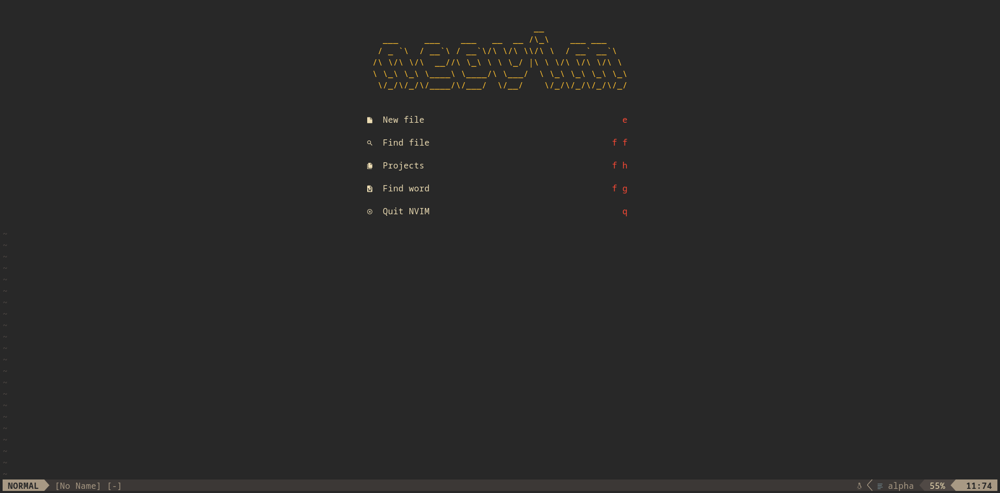
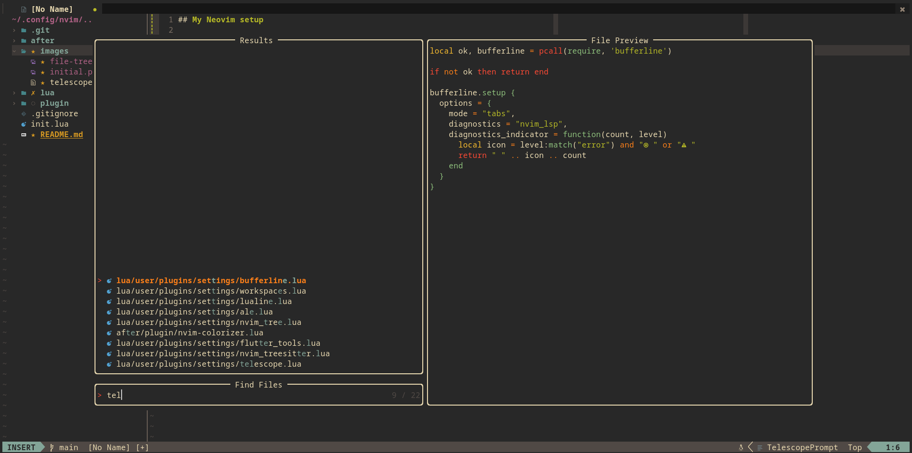

## My Neovim Setup

* [gruvbox](https://github.com/ellisonleao/gruvbox.nvim) as theme
* [lualine](https://github.com/nvim-lualine/lualine.nvim) as status line
* [alpha-nvim](https://github.com/goolord/alpha-nvim) as start page
* [packer.nvim](https://github.com/wbthomason/packer.nvim) as package manager 
* [nvim-tree.lua](https://github.com/nvim-tree/nvim-tree.lua) as file explorer
* [nvim-tree.lua](https://github.com/nvim-tree/nvim-web-devicons) for icons
* [telescope](https://github.com/nvim-telescope/telescope.nvim) to finding things
* [nvim-cmp](https://github.com/hrsh7th/nvim-cmp) for autocomplete

and other amazing plugins

